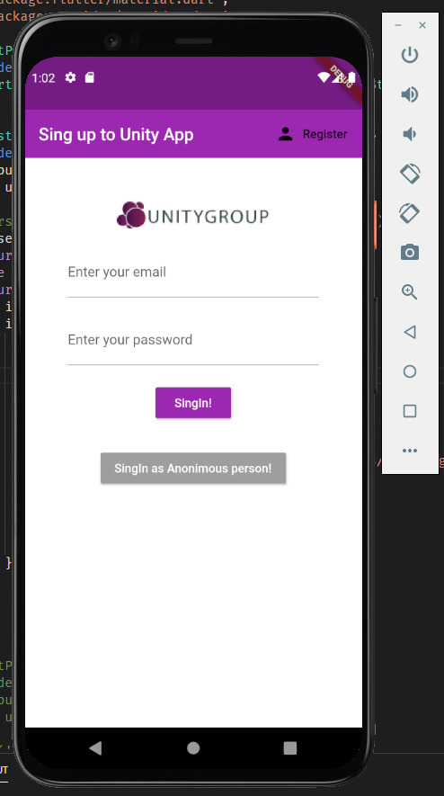
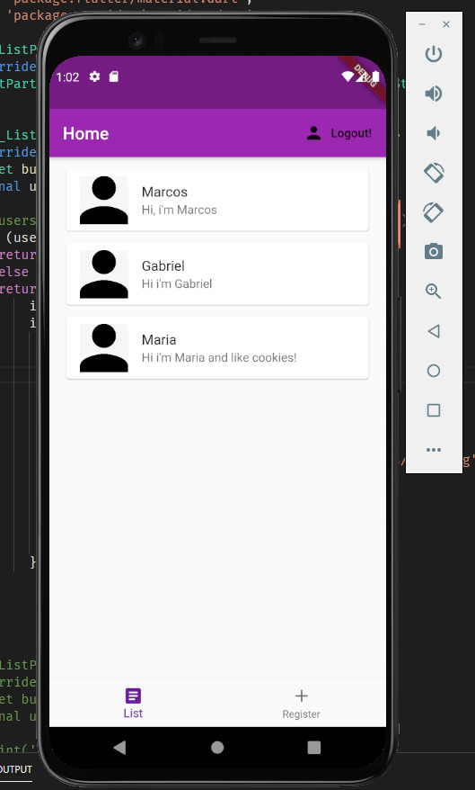
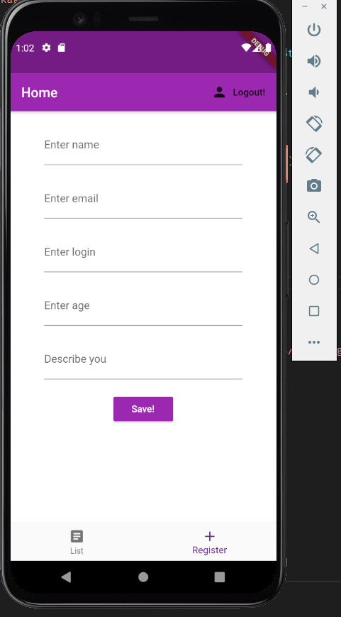

# unityapp
Aplicativo desenvolvido para o processo seletivo da empresa UnityGroup no Pará. <br/>
O aplicativo usa o serviço do Firebase como backend e o framework Flutter para desenvolvimento do aplicativo Android.

# Para ultilizar o app, é necessário ter um emulador Android e Flutter instalados.
### Para instalar o Flutter siga o tutorial disponível em: <https://flutter.dev/docs/get-started/install>
### Para instalar um emulador Android siga o tutorial disponível em: <https://developer.android.com/studio/run/emulator>

Com ele rodando, dentro do repositório do projeto vá para ~/unityapp/unityapp/
e execute: <br/>
```flutter run```

### Imagens do app







